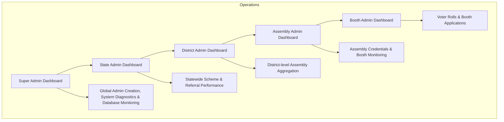

# BJP Nalam Thittam Welfare Portal — Full Project & 5-Tier Admin Dashboard Technical Analysis

---

## 1. Executive Summary & Overview

The **BJP Nalam Thittam Welfare Schemes Portal** is an enterprise-grade digital governance platform built to facilitate voter enrollment, scheme application tracking, voter roll verification across 233 assembly constituencies in Tamil Nadu, and hierarchical administrative oversight.

The core of the administrative system is a **5-Tier Roles-Based Access Control (RBAC) Dashboard System** that provides tailored, real-time insights for administrative levels:

1. **Super Admin Dashboard** (`SuperAdminDashboard.jsx`)
2. **State Admin Dashboard** (`StateAdminDashboard.jsx`)
3. **District Admin Dashboard** (`DistrictAdminDashboard.jsx`)
4. **Assembly Admin Dashboard** (`AssemblyAdminDashboard.jsx`)
5. **Booth Admin Dashboard** (`BoothAdminDashboard.jsx`)

Each level provides granular reporting, status tracking, application lifecycle management, dynamic schema updates for the 23 Central BJP Welfare Schemes, excel/csv exports, and real-time monitoring of concurrent user operations.

---

## 2. Technical Stack Overview

### Frontend Architecture
- **Framework**: React 18 (Vite build system, React Router v7)
- **UI Components & Icons**: Lucide React (`lucide-react`), Custom CSS Modules, Responsive Cards & Tables
- **Exporting & Utilities**: ExcelJS (`exceljs`), HTML2Canvas, QRCode generation, CropperJS
- **HTTP Client**: Axios (`axios`) with Interceptor setup for JWT Authorization header injection

### Backend Architecture
- **Runtime & Server**: Node.js, Express.js API framework
- **Database Engine**: MongoDB (Dual Database System)
  - **Application DB** (`bjp_nalam_thittam_db` via Mongoose): Handles Admins, Users, Scheme Applications, and OTP sessions.
  - **Voter DB** (`voter_db` via MongoClient): Sharded/Partitioned across 233 separate Mongo collections matching Tamil Nadu Assembly Constituencies.
- **Security & Authentication**: JWT (JSON Web Tokens), Bcryptjs password hashing, Express CORS middleware, Request Context Correlation IDs, Winston logging middleware.

---

## 3. The 5-Tier Admin Dashboard Breakdown



### Dashboard Level 1: Super Admin (`SuperAdminDashboard.jsx`)
* **Role**: `SUPER_ADMIN`
* **Access Scope**: Full System Access (All 38 Districts, 234 Assemblies, 65,000+ Booths).
* **Key Features**:
  * Real-Time Global Dashboard Stats (`GET /api/admin/dashboard-stats`).
  * System Diagnostics & Server Online Health Tracking.
  * Credential Generator & Manager for State, District, Assembly, and Booth Admins.
  * Universal CSV and Excel report exports with custom status and date filters.
  * Scheme Popularity & Top Referrer Leaderboards across Tamil Nadu.

### Dashboard Level 2: State Admin (`StateAdminDashboard.jsx`)
* **Role**: `STATE_ADMIN`
* **Access Scope**: Tamil Nadu Statewide Monitoring.
* **Key Features**:
  * District-wise comparison breakdown table (Applied Voters vs total registered voters in roll).
  * Scheme distribution metrics for all 23 Central BJP Welfare Schemes.
  * Statewide referral campaign metrics.
  * Export options for State-level scheme applications.

### Dashboard Level 3: District Admin (`DistrictAdminDashboard.jsx`)
* **Role**: `DISTRICT_ADMIN`
* **Access Scope**: Single Assigned District (e.g., *Chengalpattu*, *Chennai*, *Coimbatore*).
* **Key Features**:
  * Auto-filtered metrics strictly scoped to the admin's assigned district via MongoDB `$match`.
  * Assembly Constituency breakdown within the district.
  * Assembly Admin Credential List generation and verification.
  * Application status updates (Approve, Reject, Under Review, Verified).

### Dashboard Level 4: Assembly Admin (`AssemblyAdminDashboard.jsx`)
* **Role**: `ASSEMBLY_ADMIN`
* **Access Scope**: Single Assembly Constituency (e.g., *Thiruporur*, *Velachery*).
* **Key Features**:
  * Booth performance breakdown for all polling booths in the assembly constituency.
  * Dynamic Booth Credential management & display.
  * Local voter application review and verification log update.

### Dashboard Level 5: Booth Admin (`BoothAdminDashboard.jsx`)
* **Role**: `BOOTH_ADMIN`
* **Access Scope**: Individual Polling Booth (e.g., *Booth #1 in Thiruporur*).
* **Key Features**:
  * Ground-level voter application intake and status tracking.
  * Direct voter outreach tracking and member profile timeline history.
  * Action items: Call voter, verify documents, set application to `Approved` or `Rejected`.

---

## 4. Backend API Endpoints & Routes Matrix

### Authentication & Admin Credentials (`/api/admin`)
| Endpoint | Method | Role Allowed | Description |
| :--- | :--- | :--- | :--- |
| `POST /api/admin/login` | `POST` | Public | Authenticates Mongoose admins + Dynamic Jurisdiction Admins, returns JWT |
| `GET /api/admin/dashboard-stats` | `GET` | Admin (Scoped) | Aggregated real-time metrics, status breakdowns, district/assembly stats |
| `GET /api/admin/applications` | `GET` | Admin (Scoped) | List applications with pagination, search, scheme, and status filters |
| `PUT /api/admin/applications/:id/status` | `PUT` | Admin (Scoped) | Update application status with remarks and appends to status audit history |
| `GET /api/admin/export-csv` | `GET` | Admin (Scoped) | Stream CSV export of scheme applications matching filters |
| `GET /api/admin/export-excel` | `GET` | Admin (Scoped) | Download rich `.xlsx` Excel spreadsheet formatted report |
| `POST /api/admin/create-credential` | `POST` | `SUPER_ADMIN` | Dynamically create new district, assembly, or booth admin accounts |
| `GET /api/admin/credentials` | `GET` | `SUPER_ADMIN` | List all system admin credentials |
| `GET /api/admin/jurisdiction-assemblies` | `GET` | Admin | Get list of all 234 assembly constituencies with voter roll counts |

### Schemes Catalog & User Chatbot (`/api/schemes` & `/api/userChat`)
| Endpoint | Method | Role Allowed | Description |
| :--- | :--- | :--- | :--- |
| `GET /api/schemes` | `GET` | Public | Returns the catalog of 23 Central BJP Welfare Schemes |
| `POST /api/chat` | `POST` | Public / User | AI chatbot interaction for scheme inquiry and multi-language support |

### System Health & Status Endpoint (`/`)
| Endpoint | Method | Description |
| :--- | :--- | :--- |
| `GET /` | `GET` | Root API status endpoint showing server online status, version, DB connection status |
| `GET /api/health` | `GET` | Health check endpoint returning HTTP 200 OK |

---

## 5. Database Models & Schema Design

### 1. Admin Model (`models/Admin.js`)
```javascript
const adminSchema = new mongoose.Schema({
  username: { type: String, required: true, unique: true, trim: true },
  password: { type: String, required: true },
  role: { 
    type: String, 
    enum: ['SUPER_ADMIN', 'STATE_ADMIN', 'DISTRICT_ADMIN', 'ASSEMBLY_ADMIN', 'BOOTH_ADMIN'], 
    required: true 
  },
  district: { type: String, default: null },
  assemblyName: { type: String, default: null },
  boothNo: { type: String, default: null },
  createdBy: { type: String, default: 'SYSTEM' },
  createdAt: { type: Date, default: Date.now }
});
```

### 2. Scheme Application Model (`models/SchemeApplication.js`)
```javascript
const statusHistorySchema = new mongoose.Schema({
  status: { 
    type: String, 
    enum: ['Pending', 'Submitted', 'Processing', 'Completed', 'In Progress', 'Called', 'Verified', 'Approved', 'Rejected'] 
  },
  remarks: { type: String, default: '' },
  updatedBy: { type: String, default: 'System' },
  updatedAt: { type: Date, default: Date.now }
});

const schemeApplicationSchema = new mongoose.Schema({
  userId: { type: mongoose.Schema.Types.ObjectId, ref: 'User', required: true },
  epicNo: { type: String, required: true },
  voterName: { type: String, required: true },
  mobile: { type: String, required: true },
  district: { type: String, required: true },
  assemblyName: { type: String, required: true },
  boothNo: { type: String, required: true },
  schemeId: { type: Number, default: 1 },
  schemeName: { type: String, required: true },
  status: { type: String, default: 'Pending' },
  adminRemarks: { type: String },
  lastCalledAt: { type: Date, default: null },
  statusHistory: [statusHistorySchema],
  appliedAt: { type: Date, default: Date.now }
});
```

### 3. User Model (`models/User.js`)
```javascript
const userSchema = new mongoose.Schema({
  mobile: { type: String, required: true, unique: true },
  epicNo: { type: String, required: true, unique: true, uppercase: true },
  voterName: { type: String, required: true },
  district: { type: String, required: true },
  assemblyName: { type: String, required: true },
  boothNo: { type: String, required: true },
  referralCode: { type: String, unique: true, required: true },
  referredBy: { type: String, default: null },
  createdAt: { type: Date, default: Date.now }
});
```

---

## 6. Application Lifecycle & Status Workflow

Each scheme application follows a clear state transition path with immutable status audit logging:

```
[ Voter App Output ] --> Submitted / Pending
                              │
                              ▼
                     [ Admin Review: Called ]
                              │
                              ▼
                    [ Document Verified ]
                         │         │
                         ▼         ▼
                     Approved   Rejected
```

Every status update triggered from any of the 5 Admin Dashboards automatically executes:
1. Status field update in `SchemeApplication`.
2. Append to `statusHistory` array with timestamp, admin username, and custom remarks.
3. Live update to the Dashboard statistics.

---

## 7. Real-Time Tracking, Concurrent Users & Server Monitoring

### Request Correlation & Latency Logging
- Middlewares `requestContext` and `requestLogger` generate a unique `correlationId` per HTTP request.
- Latency and memory metrics are recorded using Winston logger to monitor concurrent access during high traffic.

### Online API Health Status Response
Accessing `GET /` on the API server returns real-time diagnostic payload:

```json
{
  "status": "ONLINE",
  "message": "BJP Nalam Thittam API Server Operational",
  "version": "1.0.0",
  "backend_url": "https://bjp-scheme.onrender.com",
  "frontend_url": "https://bjp-scheme.vercel.app",
  "database_connections": {
    "app_database": "CONNECTED (Mongoose - bjp_nalam_thittam_db)",
    "voter_database": "CONNECTED (MongoClient - voter_db)"
  },
  "schemes_info": {
    "total_schemes": 23,
    "name": "23 Central BJP Welfare Schemes"
  }
}
```

---

## 8. API Keys & Environment Configuration

Below are the key environment variable requirements for running the online system backend and frontend:

### Backend `.env` Configuration
```env
PORT=5000
NODE_ENV=production

# MongoDB Credentials & Database URIs
MONGODB_URI=mongodb+srv://<username>:<password>@cluster0.mongodb.net/bjp_nalam_thittam_db?retryWrites=true&w=majority
VOTER_DB_URI=mongodb+srv://<username>:<password>@cluster0.mongodb.net/voter_db?retryWrites=true&w=majority

# Security & JWT Tokens
JWT_SECRET=<set-a-long-random-secret-in-env>   # redacted — never commit the real value

# Production Deployment URLs
BACKEND_URL=https://bjp-scheme.onrender.com
FRONTEND_URL=https://bjp-scheme.vercel.app
```

### Frontend `.env` Configuration
```env
VITE_API_BASE_URL=https://bjp-scheme.onrender.com/api
```

---

## 9. Default System Seed Admin Credentials Matrix

To test all 5 Admin Dashboards locally or in staging:

| Role | Level | Username | Password | Default Scope |
| :--- | :--- | :--- | :--- | :--- |
| **Super Admin** | Level 1 | `admin` | `admin` | Statewide (All 38 Districts) |
| **State Admin** | Level 2 | `BJP` | `BJP@2026` | Tamil Nadu State |
| **District Admin** | Level 3 | `district_chengalpattu` | `BJP@2026` | District: Chengalpattu |
| **Assembly Admin** | Level 4 | `ass_thiruporur` | `BJP@2026` | Assembly: Thiruporur |
| **Booth Admin** | Level 5 | `booth_thiruporur_1` | `BJP@2026` | Booth: #1 (Thiruporur) |

---

## 10. Summary & Recommended Next Steps

The system provides complete governance across all 5 administrative levels, dynamic election roll data access across 233 collections, real-time application processing, and comprehensive reporting engines.
