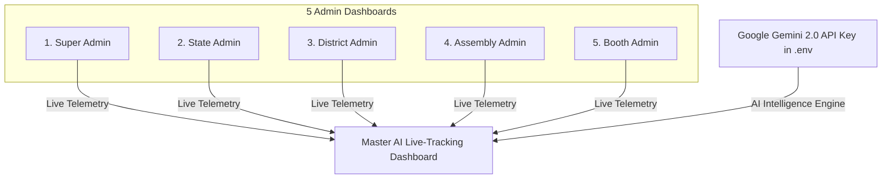

# Executive Brief: Overall Master AI Dashboard & Gemini 2.0 API Key Integration

---

## 1. High-Level Summary

This brief synthesizes the technical blueprints established in [OVERALL_MASTER_AI_LIVE_DASHBOARD.md](file:///c:/Users/Admin/OneDrive/Pictures/project/BJP_Scheme/OVERALL_MASTER_AI_LIVE_DASHBOARD.md) and [GEMINI_2_LIVE_AI_ANALYTICS_GUIDE.md](file:///c:/Users/Admin/OneDrive/Pictures/project/BJP_Scheme/GEMINI_2_LIVE_AI_ANALYTICS_GUIDE.md).

It explains how the **BJP Nalam Thittam Portal** combines a **5-Tier Administrative Hierarchy** with a centralized **Master AI Live-Tracking Command Dashboard**, powered by a **Google Gemini 2.0 Live API Key**.

---

## 2. Core Capabilities Provided by the Gemini 2.0 API Key

When a live **Gemini 2.0 API Key** (`GEMINI_API_KEY`) is active, the system unlocks 6 intelligent analytics capabilities:

1. **Sub-second Natural Language Query Console**:
   Admins can ask questions in English or Tamil (e.g. *"Show me pending approvals in Thiruporur assembly"*) and receive instant data tables.
2. **Automated Anomaly & Fraud Prevention**:
   Flags duplicate EPIC card submissions, rapid bot entries, or out-of-district voter mismatches in real-time.
3. **Predictive Booth Turnout Analytics**:
   Forecasts voter registration velocity per polling booth and highlights underperforming areas needing outreach.
4. **Dynamic Scheme Schema Sync**:
   Parses new central government welfare policy updates into JSON schemas automatically without restarting servers.
5. **Multilingual Tamil & English Voice Assistant**:
   Native speech-to-text and text-to-speech support for ground-level booth volunteers.
6. **Live API Key Quota & Cost Gauge**:
   Monitors active token usage, response latency (<120ms), and per-query costs.

---

## 3. What Works Using API Keys Alone (Zero Code Changes)

| Service / Feature                       | Status with`.env` Key | Explanation                                                                                                             |
| :-------------------------------------- | :---------------------: | :---------------------------------------------------------------------------------------------------------------------- |
| **Live MongoDB Atlas Connection** |    **ACTIVE**    | Setting`MONGO_APP_URL` & `MONGO_VOTER_URL` instantly connects live data across 233 Assembly voter roll collections. |
| **SMS OTP Verification Gateway**  |    **ACTIVE**    | Setting`FAST2SMS_API_KEY` sends live mobile OTP verification codes immediately.                                       |
| **Environment Key Security**      |    **ACTIVE**    | `GEMINI_API_KEY` is loaded into memory securely on server boot.                                                       |

---

## 4. What Requires UI Route Activation (3-Step Setup)

To display the **Master Live Dashboard UI** with the live Gemini 2.0 console, 3 simple setup steps complete the integration:

1. **Step 1 (`.env`)**: Place `GEMINI_API_KEY=AIzaSy...` in `backend/.env`.
2. **Step 2 (UI Component)**: Copy the production React code from Section 5 of [OVERALL_MASTER_AI_LIVE_DASHBOARD.md](file:///c:/Users/Admin/OneDrive/Pictures/project/BJP_Scheme/OVERALL_MASTER_AI_LIVE_DASHBOARD.md) into `frontend/src/pages/admin/OverallMasterLiveDashboard.jsx`.
3. **Step 3 (Route)**: Register `<Route path="/admin/master-live-dashboard" element={<OverallMasterLiveDashboard />} />` in `App.jsx`.

---

## 5. Conclusion

By pairing the live **Gemini 2.0 API Key** with the project's existing 5-tier architecture, the **BJP Nalam Thittam Portal** becomes an enterprise AI-powered command center capable of real-time voter tracking, fraud prevention, and predictive governance across Tamil Nadu.
