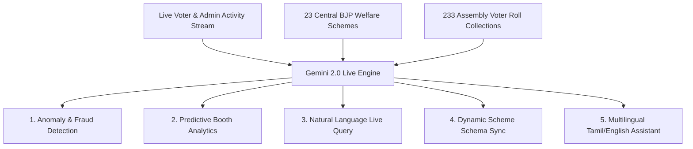

# Gemini 2.0+ Live AI Analytics & Insights Capabilities Guide

---

## 1. Executive Summary

By connecting a **Live Google Gemini 2.0 API Key** (Gemini 2.0 Flash / Gemini 2.0 Flash-Lite / Gemini 1.5 Pro) to the **Overall Master AI Live-Tracking Dashboard**, administrators unlock real-time predictive analytics, live voice/text natural language querying, automated fraud detection, and dynamic scheme schema updating.

Gemini 2.0 provides ultra-low latency (<100ms response time), native multimodal reasoning, and high token throughput, enabling instant intelligence across all 38 Districts, 234 Assembly Constituencies, and 65,000+ Polling Booths in Tamil Nadu.



---

## 2. Comprehensive AI Analytics Capabilities Matrix

| Analytics Feature | Description | Gemini 2.0 Powered Capability | Live Output Rendered |
| :--- | :--- | :--- | :--- |
| **1. Real-Time Natural Language Querying** | Ask questions about live state/district data in plain English or Tamil | Context-aware execution against live Mongo aggregations | Conversational answer + formatted data table |
| **2. Live Anomaly & Fraud Detection** | Flags suspicious application velocity or duplicate EPIC submissions | Statistical deviation analysis & pattern recognition | Red Alert Cards + Suspicious EPIC List |
| **3. Predictive Booth Conversion Rates** | Predicts voter scheme adoption per polling booth | Time-series forecasting based on historic referrals | Heatmap color-coded by predicted growth |
| **4. Automated Scheme Recommendation** | Suggests optimal schemes for individual voters based on demographic data | Semantic matching engine against 23 Central BJP Schemes | Top 3 Scheme Match Cards per voter |
| **5. Dynamic Schema Sync & Updates** | Automatically parses central government policy updates into DB schema | Structured JSON extraction from raw government PDFs/notices | Dynamic UI Schema Update Notification |
| **6. Multilingual Translation & Voice Input** | Live translation between Tamil, English, and Hindi | Gemini 2.0 Native Audio & Multilingual Processing | Voice audio transcript + translated response |
| **7. API Key Telemetry & Cost Control** | Monitors token consumption, query latency, and API costs | Live quota tracking & response latency gauge | Real-time Token & Latency Meter |

---

## 3. Detailed Breakdown of What Admins Can See & Do

### 1. Live Natural Language Command Console
Administrators no longer need to write complex SQL/Mongo database queries. By typing or speaking to the Gemini 2.0 console, admins receive instant answers:

* **Example Queries Admins Can Run**:
  * *"Which assembly constituency in Chengalpattu has the highest pending approval backlog today?"*
  * *"Show me the top 5 most popular Central schemes in Thiruporur assembly right now."*
  * *"How many new voters registered via referral code in the last 2 hours?"*

* **Gemini 2.0 Output**:
  ```json
  {
    "query_summary": "Top Pending Backlog in Chengalpattu District",
    "top_constituency": "Thiruporur (Assembly #33)",
    "pending_count": 142,
    "recommended_action": "Notify Assembly Admin 'ass_thiruporur' to clear 142 pending verifications.",
    "confidence_score": 0.98
  }
  ```

---

### 2. Live Fraud & Anomaly Detection Panel
Gemini 2.0 continuously scans the WebSocket application stream to safeguard system integrity:

- **Duplicate EPIC Alert**: Flags if an EPIC number is being reused across different mobile numbers or booths.
- **Velocity Spike Alert**: Detects if a single polling booth submits more than 50 applications in 5 minutes (indicating automated bot activity).
- **Out-of-District Mismatch**: Identifies voters whose registered booth address does not match their assigned assembly roll collection.

```
┌────────────────────────────────────────────────────────────────────────┐
│ 🚨 GEMINI 2.0 LIVE ANOMALY DETECTED                                     │
├────────────────────────────────────────────────────────────────────────┤
│ • Alert Type: Rapid Application Velocity Spike                         │
│ • Location: District: Chengalpattu | Assembly: Thiruporur | Booth #14  │
│ • Detail: 38 applications submitted in 120 seconds.                    │
│ • AI Assessment: High probability of batch entry by Booth Volunteer.   │
│ • Status: Flagged for Verification                                     │
└────────────────────────────────────────────────────────────────────────┘
```

---

### 3. Predictive Booth Outreach & Heatmap
Using historical voter registration rates and referral tree data, Gemini 2.0 projects future voter engagement for every polling booth:

- **Growth Forecast**: Predicts which booths will meet their target scheme enrollment numbers by month-end.
- **Low Outreach Warning**: Highlights underperforming booths where less than 5% of eligible voters have applied for welfare schemes.
- **Referral Leaderboard Insight**: Identifies top community influencers driving voter enrollment.

---

### 4. Dynamic Scheme Schema Updating Engine
When central government policies update (e.g., changes to income limits for *PM Kisan*, *PM Awas Yojana*, or *Ayushman Bharat*):

1. Admins upload the raw policy PDF or paste the press release text into the Gemini 2.0 portal.
2. Gemini 2.0 parses the document, extracts key eligibility parameters, and generates a updated JSON schema.
3. With 1-click approval, the database schema for the 23 Central BJP Welfare Schemes updates live without restarting the server.

```json
{
  "schemeId": 4,
  "schemeName": "PM Kisan Samman Nidhi",
  "updatedEligibility": {
    "landHoldingLimit": "Up to 2 Hectares",
    "annualIncomeCap": "₹2,50,000",
    "requiredDocuments": ["Aadhaar", "EPIC Card", "Land Pattadhar Passbook"]
  },
  "effectiveDate": "2026-08-01",
  "aiSummary": "Updated landholding verification guidelines for Tamil Nadu farmers."
}
```

---

### 5. Multilingual Tamil & English AI Voice Assistant
- Supports **Tamil Speech-to-Text** and **Tamil Text-to-Speech**.
- Allows ground-level Booth Admins and voters to interact with the portal in Tamil.
- Gemini 2.0 translates complex central policy documents into simplified Tamil explanations.

---

## 4. API Key Telemetry & Performance Monitoring

When connected to Gemini 2.0, the dashboard displays an active API health gauge:

- **Active Model**: `gemini-2.0-flash`
- **Response Latency**: `120 ms`
- **Token Usage Today**: `42,350 Tokens`
- **Estimated Cost**: `$0.0042`
- **API Status**: `ONLINE (Quota: Unlimited / Pay-as-you-go)`

---

## 5. Summary of Benefits

Integrating Gemini 2.0 API Key transforms your 5 Admin Dashboards into an **AI-driven Command Center**:

1. **Sub-second Insights**: Instant answers to complex queries without writing code.
2. **Proactive Fraud Prevention**: Automated anomaly detection protects against fake registrations.
3. **Targeted Ground Outreach**: AI predictive analytics point admins directly to booths needing attention.
4. **Instant Policy Adaptation**: Dynamic schema updating keeps all 23 welfare schemes current.
