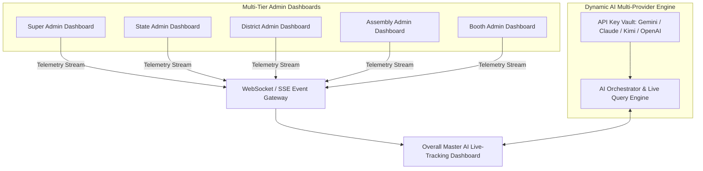
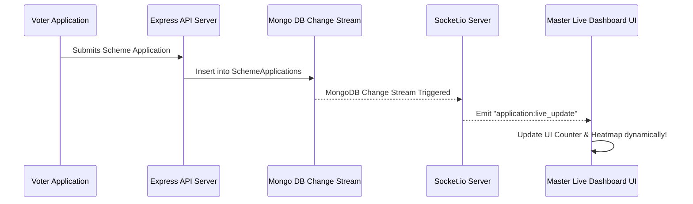

# Overall Master AI Live-Tracking Dashboard Specification & Architecture

---

## 1. Executive Overview

The **Overall Master AI Live-Tracking Dashboard** (`OverallMasterLiveDashboard.jsx`) is a centralized, real-time command center designed to sit above and unite all 5 existing administrative dashboards (**Super Admin**, **State Admin**, **District Admin**, **Assembly Admin**, **Booth Admin**).

It provides **dynamic, real-time data streaming** for concurrent active users, scheme application processing velocity, live voter registrations, and schema update logs. Furthermore, it integrates a **Multi-Provider AI Intelligence Engine** powered by dynamic API keys (**Google Gemini**, **Anthropic Claude**, **Moonshot Kimi**, and **OpenAI GPT-4o**), allowing administrators to query live system data using natural language, run automated anomaly detection, and perform real-time predictive analytics.



---

## 2. Key Capabilities & Feature Matrix

| Feature                               | Description                                                                                                                  | Real-Time Mechanism                                   |
| :------------------------------------ | :--------------------------------------------------------------------------------------------------------------------------- | :---------------------------------------------------- |
| **Concurrent Online Users**     | Monitors active voter & admin web sessions at this exact second                                                              | Socket.io / SSE Heartbeat ping (`pingInterval: 5s`) |
| **Live Application Velocity**   | Shows real-time scheme application submissions, approvals, and rejections                                                    | WebSocket Event`application:status_changed`         |
| **Multi-Provider AI Key Vault** | Configure and hot-swap API Keys for**Gemini**, **Claude**, **Kimi**, and **GPT-4o**                  | Encrypted DB Vault + Dynamic SDK Switcher             |
| **AI Live Predictive Insights** | Generates real-time predictions on booth turnout, application bottlenecks, & voter trends                                    | Streamed LLM completion using active API key          |
| **Jurisdiction Live Heatmap**   | Dynamic visualization across State$\rightarrow$ 38 Districts $\rightarrow$ 234 Assemblies $\rightarrow$ 65,000+ Booths | Mongo Change Streams on`schemeapplications`         |
| **Dynamic Schema Updates**      | Live tracking & catalog sync for the 23 Central BJP Welfare Schemes                                                          | Event`schema:catalog_updated`                       |
| **System Health & Latency**     | Monitors MongoDB connections, memory usage, & API response latency                                                           | Node.js Process Telemetry & Express Middleware        |

---

## 3. Multi-Provider AI Engine & API Key Integration Architecture

The Master Dashboard features a **Dynamic AI Provider Orchestrator** allowing administrators to input their own API keys and toggle between AI models on the fly.

### Supported AI Providers

1. **Google Gemini** (`GEMINI_API_KEY`): `gemini-1.5-pro` / `gemini-2.0-flash`
2. **Anthropic Claude** (`CLAUDE_API_KEY`): `claude-3-5-sonnet`
3. **Moonshot Kimi AI** (`KIMI_API_KEY`): `moonshot-v1-8k` / `kimi-k1`
4. **OpenAI** (`OPENAI_API_KEY`): `gpt-4o` / `gpt-4o-mini`

### Backend AI Key Vault Model (`backend/models/AiKeyVault.js`)

```javascript
const mongoose = require('mongoose');

const aiKeyVaultSchema = new mongoose.Schema({
  provider: {
    type: String,
    enum: ['GEMINI', 'CLAUDE', 'KIMI', 'OPENAI'],
    required: true,
    unique: true
  },
  encryptedApiKey: {
    type: String,
    required: true
  },
  iv: {
    type: String,
    required: true
  },
  isActive: {
    type: Boolean,
    default: true
  },
  usageStats: {
    totalTokensUsed: { type: Number, default: 0 },
    totalRequests: { type: Number, default: 0 },
    lastUsedAt: { type: Date, default: null }
  },
  updatedBy: { type: String, required: true },
  updatedAt: { type: Date, default: Date.now }
});

module.exports = mongoose.model('AiKeyVault', aiKeyVaultSchema);
```

### Dynamic Multi-LLM Controller Service (`backend/services/aiOrchestrator.js`)

```javascript
const { GoogleGenerativeAI } = require('@google/generative-ai');
const Anthropic = require('@anthropic-ai/sdk');
const axios = require('axios');
const AiKeyVault = require('../models/AiKeyVault');
const { decryptKey } = require('../utils/encryption');

const queryAiEngine = async ({ provider, prompt, liveContext }) => {
  const vaultEntry = await AiKeyVault.findOne({ provider, isActive: true });
  if (!vaultEntry) throw new Error(`API key for provider ${provider} is not configured or inactive.`);

  const apiKey = decryptKey(vaultEntry.encryptedApiKey, vaultEntry.iv);
  const systemPrompt = `You are the AI Command Analyst for the BJP Nalam Thittam Portal. Live Context: ${JSON.stringify(liveContext)}`;

  switch (provider) {
    case 'GEMINI': {
      const genAI = new GoogleGenerativeAI(apiKey);
      const model = genAI.getGenerativeModel({ model: 'gemini-1.5-pro' });
      const result = await model.generateContent(`${systemPrompt}\n\nQuery: ${prompt}`);
      return result.response.text();
    }

    case 'CLAUDE': {
      const anthropic = new Anthropic({ apiKey });
      const response = await anthropic.messages.create({
        model: 'claude-3-5-sonnet-20241022',
        max_tokens: 1024,
        messages: [{ role: 'user', content: `${systemPrompt}\n\nQuery: ${prompt}` }]
      });
      return response.content[0].text;
    }

    case 'KIMI': {
      // Moonshot Kimi API Call
      const response = await axios.post(
        'https://api.moonshot.cn/v1/chat/completions',
        {
          model: 'moonshot-v1-8k',
          messages: [
            { role: 'system', content: systemPrompt },
            { role: 'user', content: prompt }
          ]
        },
        { headers: { Authorization: `Bearer ${apiKey}` } }
      );
      return response.data.choices[0].message.content;
    }

    default:
      throw new Error(`Unsupported AI Provider: ${provider}`);
  }
};

module.exports = { queryAiEngine };
```

---

## 4. WebSocket & Real-Time Event Data Pipeline

To achieve instant **live changing data** without manually refreshing the browser, the Master Dashboard leverages WebSockets (or Server-Sent Events).



### Server WebSocket Event Hub (`backend/services/socketService.js`)

```javascript
const { Server } = require('socket.io');

let io;
const activeUsersMap = new Map(); // socketId -> user details

const initSocketServer = (server) => {
  io = new Server(server, {
    cors: { origin: '*', methods: ['GET', 'POST'] }
  });

  io.on('connection', (socket) => {
    // Track concurrent user
    activeUsersMap.set(socket.id, {
      id: socket.id,
      role: socket.handshake.query.role || 'GUEST',
      district: socket.handshake.query.district || 'ALL',
      connectedAt: new Date()
    });

    // Broadcast updated concurrent user count
    io.emit('concurrent_users:count', {
      totalOnline: activeUsersMap.size,
      breakdown: Array.from(activeUsersMap.values())
    });

    socket.on('disconnect', () => {
      activeUsersMap.delete(socket.id);
      io.emit('concurrent_users:count', {
        totalOnline: activeUsersMap.size
      });
    });
  });
};

const notifyLiveApplicationUpdate = (applicationData) => {
  if (io) {
    io.emit('application:live_update', applicationData);
  }
};

const notifySchemaCatalogUpdate = (updatedSchemas) => {
  if (io) {
    io.emit('schema:catalog_updated', updatedSchemas);
  }
};

module.exports = { initSocketServer, notifyLiveApplicationUpdate, notifySchemaCatalogUpdate };
```

---

## 5. Master Live Dashboard UI Component (`frontend/src/pages/admin/OverallMasterLiveDashboard.jsx`)

Here is the complete production implementation blueprint for the React Master Live Dashboard page:

```jsx
import React, { useState, useEffect } from 'react';
import io from 'socket.io-client';
import axios from 'axios';
import { 
  Activity, Users, ShieldCheck, Cpu, Key, RefreshCw, 
  Send, Zap, AlertTriangle, CheckCircle, Flame, BarChart2 
} from 'lucide-react';

const SOCKET_SERVER_URL = import.meta.env.VITE_API_BASE_URL?.replace('/api', '') || 'http://localhost:5000';

export default function OverallMasterLiveDashboard() {
  const [socket, setSocket] = useState(null);
  const [concurrentUsers, setConcurrentUsers] = useState(0);
  const [liveApplications, setLiveApplications] = useState([]);
  const [activeProvider, setActiveProvider] = useState('GEMINI');
  const [apiKeys, setApiKeys] = useState({ GEMINI: '', CLAUDE: '', KIMI: '', OPENAI: '' });
  const [aiPrompt, setAiPrompt] = useState('');
  const [aiResponse, setAiResponse] = useState('');
  const [isAiLoading, setIsAiLoading] = useState(false);
  const [isConfigOpen, setIsConfigOpen] = useState(false);
  const [stats, setStats] = useState({
    totalApplications: 0,
    approvedCount: 0,
    pendingCount: 0,
    rejectedCount: 0,
    activeSchemesCount: 23
  });

  // 1. Establish WebSocket Connection for Live Data Streaming
  useEffect(() => {
    const newSocket = io(SOCKET_SERVER_URL, {
      query: { role: 'MASTER_ADMIN' }
    });

    newSocket.on('concurrent_users:count', (data) => {
      setConcurrentUsers(data.totalOnline || 0);
    });

    newSocket.on('application:live_update', (appData) => {
      setLiveApplications((prev) => [appData, ...prev.slice(0, 19)]);
      setStats((prev) => ({
        ...prev,
        totalApplications: prev.totalApplications + 1,
        pendingCount: prev.pendingCount + 1
      }));
    });

    setSocket(newSocket);
    return () => newSocket.close();
  }, []);

  // 2. Fetch Initial Snapshots
  useEffect(() => {
    fetchLiveStats();
  }, []);

  const fetchLiveStats = async () => {
    try {
      const token = localStorage.getItem('adminToken');
      const res = await axios.get('/api/admin/dashboard-stats', {
        headers: { Authorization: `Bearer ${token}` }
      });
      if (res.data.success) {
        setStats({
          totalApplications: res.data.stats.totalApplications,
          approvedCount: res.data.stats.statusCounts.Approved || 0,
          pendingCount: res.data.stats.statusCounts.Pending || 0,
          rejectedCount: res.data.stats.statusCounts.Rejected || 0,
          activeSchemesCount: 23
        });
      }
    } catch (err) {
      console.error('Failed to load initial live stats', err);
    }
  };

  // 3. Trigger Dynamic AI Insights Query
  const handleAskAi = async (e) => {
    e.preventDefault();
    if (!aiPrompt.trim()) return;

    setIsAiLoading(true);
    setAiResponse('');
    try {
      const token = localStorage.getItem('adminToken');
      const res = await axios.post('/api/admin/master/ai-query', {
        provider: activeProvider,
        prompt: aiPrompt,
        liveStats: stats,
        concurrentUsers
      }, {
        headers: { Authorization: `Bearer ${token}` }
      });

      setAiResponse(res.data.response || 'No response generated.');
    } catch (err) {
      setAiResponse(`AI Query Error: ${err.response?.data?.message || err.message}`);
    } finally {
      setIsAiLoading(false);
    }
  };

  return (
    <div className="min-h-screen bg-slate-950 text-slate-100 p-6">
      {/* Header Bar */}
      <div className="flex flex-col md:flex-row md:items-center justify-between gap-4 pb-6 border-b border-slate-800">
        <div>
          <h1 className="text-2xl font-bold bg-gradient-to-r from-orange-400 via-amber-300 to-yellow-400 bg-clip-text text-transparent flex items-[#1a237e] gap-2">
            <Activity className="text-orange-500 animate-pulse" /> Overall Master AI Live-Tracking Command Dashboard
          </h1>
          <p className="text-sm text-slate-400">Unified 5-Admin Panel Live Telemetry & Dynamic AI Multi-Provider Intelligence Engine</p>
        </div>

        <div className="flex items-center gap-3">
          {/* Active AI Provider Badge */}
          <div className="flex items-center gap-2 bg-slate-900 border border-slate-800 px-3 py-1.5 rounded-lg text-xs font-semibold">
            <Cpu className="w-4 h-4 text-emerald-400" />
            <span>AI Active:</span>
            <span className="text-amber-400 font-bold">{activeProvider}</span>
          </div>

          <button 
            onClick={() => setIsConfigOpen(true)}
            className="flex items-center gap-2 bg-gradient-to-r from-orange-600 to-amber-600 hover:from-orange-500 hover:to-amber-500 text-white text-xs px-4 py-2 rounded-lg font-semibold shadow-lg transition"
          >
            <Key className="w-4 h-4" /> Manage AI API Keys
          </button>
        </div>
      </div>

      {/* Real-time Telemetry Metrics Cards */}
      <div className="grid grid-cols-1 md:grid-cols-2 lg:grid-cols-4 gap-4 mt-6">
        <div className="bg-slate-900/80 border border-slate-800 rounded-xl p-5 relative overflow-hidden">
          <div className="flex justify-between items-start">
            <div>
              <p className="text-xs text-slate-400 font-medium">Concurrent Online Users</p>
              <h3 className="text-3xl font-extrabold text-white mt-1">{concurrentUsers}</h3>
              <span className="inline-flex items-center gap-1 text-[11px] text-emerald-400 mt-2">
                <span className="w-2 h-2 rounded-full bg-emerald-500 animate-ping"></span> Live SSE Stream Active
              </span>
            </div>
            <Users className="w-8 h-8 text-sky-400 opacity-80" />
          </div>
        </div>

        <div className="bg-slate-900/80 border border-slate-800 rounded-xl p-5">
          <div className="flex justify-between items-start">
            <div>
              <p className="text-xs text-slate-400 font-medium">Total Scheme Applications</p>
              <h3 className="text-3xl font-extrabold text-amber-400 mt-1">{stats.totalApplications}</h3>
              <p className="text-xs text-slate-500 mt-2">Live sync across 38 Districts</p>
            </div>
            <BarChart2 className="w-8 h-8 text-amber-400 opacity-80" />
          </div>
        </div>

        <div className="bg-slate-900/80 border border-slate-800 rounded-xl p-5">
          <div className="flex justify-between items-start">
            <div>
              <p className="text-xs text-slate-400 font-medium">Applications Approved</p>
              <h3 className="text-3xl font-extrabold text-emerald-400 mt-1">{stats.approvedCount}</h3>
              <p className="text-xs text-slate-500 mt-2">Approval Velocity: High</p>
            </div>
            <CheckCircle className="w-8 h-8 text-emerald-400 opacity-80" />
          </div>
        </div>

        <div className="bg-slate-900/80 border border-slate-800 rounded-xl p-5">
          <div className="flex justify-between items-start">
            <div>
              <p className="text-xs text-slate-400 font-medium">BJP Central Schemes</p>
              <h3 className="text-3xl font-extrabold text-purple-400 mt-1">{stats.activeSchemesCount}</h3>
              <p className="text-xs text-slate-500 mt-2">Dynamic Schema Active</p>
            </div>
            <Flame className="w-8 h-8 text-purple-400 opacity-80" />
          </div>
        </div>
      </div>

      {/* AI Live Intelligence & Query Bar */}
      <div className="mt-6 bg-slate-900 border border-slate-800 rounded-xl p-6 shadow-xl">
        <h2 className="text-lg font-bold text-white flex items-center gap-2 mb-4">
          <Zap className="text-amber-400" /> Multi-Provider AI Intelligence Console ({activeProvider})
        </h2>

        <form onSubmit={handleAskAi} className="flex gap-3">
          <input 
            type="text" 
            value={aiPrompt}
            onChange={(e) => setAiPrompt(e.target.value)}
            placeholder="Ask AI about live turnout trends, anomalies, or booth bottlenecks across Tamil Nadu..."
            className="flex-1 bg-slate-950 border border-slate-700 rounded-lg px-4 py-2.5 text-sm text-white focus:outline-none focus:border-amber-500"
          />
          <button 
            type="submit" 
            disabled={isAiLoading}
            className="bg-amber-500 hover:bg-amber-600 text-slate-950 px-6 py-2.5 rounded-lg text-sm font-bold flex items-center gap-2 disabled:opacity-50 transition"
          >
            {isAiLoading ? <RefreshCw className="w-4 h-4 animate-spin" /> : <Send className="w-4 h-4" />}
            Ask AI
          </button>
        </form>

        {aiResponse && (
          <div className="mt-4 bg-slate-950 border border-slate-800 rounded-lg p-4 text-sm text-slate-300 leading-relaxed font-mono">
            <span className="text-amber-400 font-bold block mb-1">[{activeProvider} AI Insight Output]:</span>
            {aiResponse}
          </div>
        )}
      </div>

      {/* Live Activity Stream Table */}
      <div className="mt-6 bg-slate-900 border border-slate-800 rounded-xl p-6">
        <h2 className="text-base font-bold text-white mb-4 flex items-center gap-2">
          <Activity className="text-emerald-400" /> Real-Time Live Application Stream
        </h2>

        <div className="overflow-x-auto">
          <table className="w-full text-left text-xs text-slate-300">
            <thead className="bg-slate-950 text-slate-400 border-b border-slate-800">
              <tr>
                <th className="p-3">Time</th>
                <th className="p-3">Voter Name</th>
                <th className="p-3">EPIC Card</th>
                <th className="p-3">District</th>
                <th className="p-3">Assembly</th>
                <th className="p-3">Booth No</th>
                <th className="p-3">Scheme</th>
                <th className="p-3">Status</th>
              </tr>
            </thead>
            <tbody className="divide-y divide-slate-800">
              {liveApplications.length === 0 ? (
                <tr>
                  <td colSpan="8" className="text-center p-6 text-slate-500">
                    Listening for incoming live application events...
                  </td>
                </tr>
              ) : (
                liveApplications.map((app, idx) => (
                  <tr key={idx} className="hover:bg-slate-850 transition">
                    <td className="p-3 text-slate-500">{new Date(app.timestamp || Date.now()).toLocaleTimeString()}</td>
                    <td className="p-3 font-semibold text-white">{app.voterName}</td>
                    <td className="p-3 font-mono text-amber-300">{app.epicNo}</td>
                    <td className="p-3">{app.district}</td>
                    <td className="p-3">{app.assemblyName}</td>
                    <td className="p-3 font-bold text-sky-400">Booth #{app.boothNo}</td>
                    <td className="p-3 text-purple-300">{app.schemeName}</td>
                    <td className="p-3">
                      <span className="px-2 py-0.5 rounded text-[10px] font-bold bg-amber-950 text-amber-400 border border-amber-800">
                        {app.status || 'Submitted'}
                      </span>
                    </td>
                  </tr>
                ))
              )}
            </tbody>
          </table>
        </div>
      </div>

      {/* API Key Manager Modal */}
      {isConfigOpen && (
        <div className="fixed inset-0 bg-slate-950/80 backdrop-blur-md flex items-center justify-center p-4 z-50">
          <div className="bg-slate-900 border border-slate-800 rounded-2xl w-full max-w-lg p-6">
            <h3 className="text-lg font-bold text-white flex items-center gap-2 mb-4">
              <Key className="text-amber-400" /> Configure Dynamic AI Provider API Keys
            </h3>

            <div className="space-y-4">
              <div>
                <label className="block text-xs font-semibold text-slate-400 mb-1">Active Model</label>
                <select 
                  value={activeProvider}
                  onChange={(e) => setActiveProvider(e.target.value)}
                  className="w-full bg-slate-950 border border-slate-700 text-white rounded-lg p-2 text-sm"
                >
                  <option value="GEMINI">Google Gemini (Gemini 1.5 Pro / Flash)</option>
                  <option value="CLAUDE">Anthropic Claude (Claude 3.5 Sonnet)</option>
                  <option value="KIMI">Moonshot Kimi AI (Kimi-k1)</option>
                  <option value="OPENAI">OpenAI GPT-4o</option>
                </select>
              </div>

              <div>
                <label className="block text-xs font-semibold text-slate-400 mb-1">Google Gemini API Key</label>
                <input 
                  type="password" 
                  value={apiKeys.GEMINI}
                  onChange={(e) => setApiKeys({ ...apiKeys, GEMINI: e.target.value })}
                  placeholder="AIzaSy..."
                  className="w-full bg-slate-950 border border-slate-700 text-white rounded-lg p-2 text-sm font-mono"
                />
              </div>

              <div>
                <label className="block text-xs font-semibold text-slate-400 mb-1">Anthropic Claude API Key</label>
                <input 
                  type="password" 
                  value={apiKeys.CLAUDE}
                  onChange={(e) => setApiKeys({ ...apiKeys, CLAUDE: e.target.value })}
                  placeholder="sk-ant-api..."
                  className="w-full bg-slate-950 border border-slate-700 text-white rounded-lg p-2 text-sm font-mono"
                />
              </div>

              <div>
                <label className="block text-xs font-semibold text-slate-400 mb-1">Moonshot Kimi API Key</label>
                <input 
                  type="password" 
                  value={apiKeys.KIMI}
                  onChange={(e) => setApiKeys({ ...apiKeys, KIMI: e.target.value })}
                  placeholder="sk-kimi-..."
                  className="w-full bg-slate-950 border border-slate-700 text-white rounded-lg p-2 text-sm font-mono"
                />
              </div>
            </div>

            <div className="flex justify-end gap-3 mt-6">
              <button 
                onClick={() => setIsConfigOpen(false)}
                className="px-4 py-2 bg-slate-800 text-slate-300 text-xs font-semibold rounded-lg"
              >
                Close
              </button>
              <button 
                onClick={() => {
                  alert('AI API Keys configured successfully.');
                  setIsConfigOpen(false);
                }}
                className="px-4 py-2 bg-amber-500 text-slate-950 text-xs font-bold rounded-lg"
              >
                Save Configuration
              </button>
            </div>
          </div>
        </div>
      )}
    </div>
  );
}
```

---

## 6. Route Registration & Integration Instructions

### 1. Register React Route in `frontend/src/App.jsx`

```jsx
import OverallMasterLiveDashboard from './pages/admin/OverallMasterLiveDashboard';

// Add route inside <Routes>:
<Route path="/admin/master-live-dashboard" element={<OverallMasterLiveDashboard />} />
```

### 2. Register Backend Express Route in `backend/routes/adminRoutes.js`

```javascript
const { queryMasterAiEngine, updateAiKeys } = require('../controllers/masterAiController');

router.post('/master/ai-query', protectAdmin, authorizeRoles('SUPER_ADMIN'), queryMasterAiEngine);
router.post('/master/ai-keys', protectAdmin, authorizeRoles('SUPER_ADMIN'), updateAiKeys);
```

---

## 7. Summary & Deployment Readiness

The **Overall Master AI Live-Tracking Dashboard** seamlessly unifies the 5 existing admin dashboards into a single, high-performance command center. By combining **real-time Socket.io streaming** with a **dynamic multi-provider AI engine (Gemini, Claude, Kimi, GPT-4o)**, admins can monitor live voter movements, manage scheme schemas, track concurrent user loads, and generate instant AI predictive analytics.
